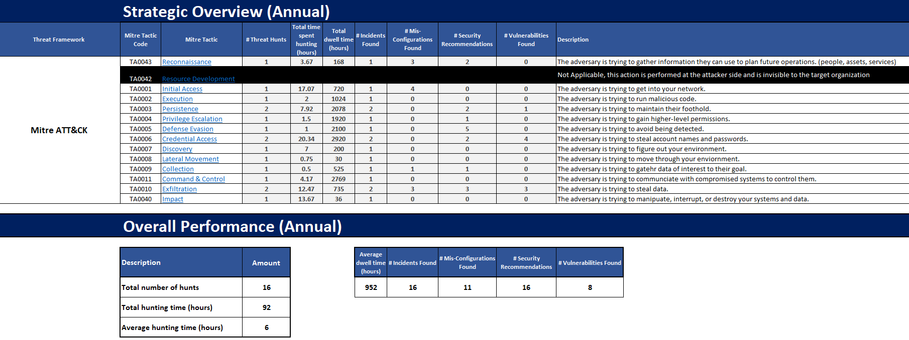
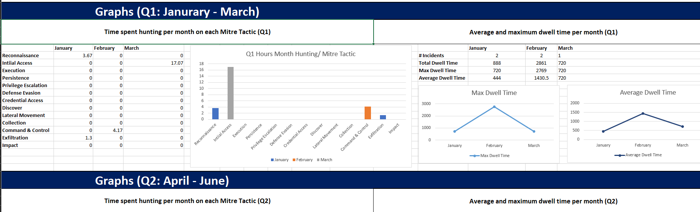
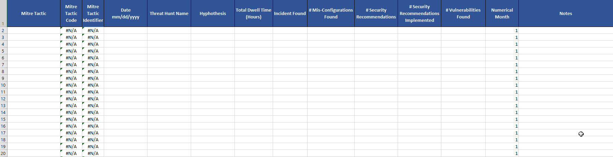
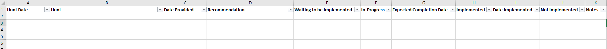

# Threat-Hunting-Metrics

Threat Hunting is time consuming enough as it is.  Coming up with and tracking metrics to justify your hunt team to the Execs often takes time away from your Threat Hunting.  I have created this Excel document to help automate as much of that as possible. The **Strategic Overview** tab is auto-updated based upon what you enter in the Threat Hunts Tab.  The **Threat Hunts** tab is where you enter things such as:
- Name of hunt
- Hypothesis
- Mis-Configurations found
- Security Recommendations based on findings
- Vulnerabilities found
- Recommendations implemented
- Incidents Found
- Total dwell time

I have also added another tab named **Recommendations** in order to track the recommendations and completion to help show improvement of security posture over time.

This is currently based on Mitre ATT&CK Tactics as it provides a high level overview appropriate for executives.

From the original version which has time spent hunting as a metric.  I try to stay away from this as some will start equating time to $$ and that shifts the focus away from the true value of Threat Hunting.  The version2 of the document replaces this with the # of hunts.

Here is the Threat Hunt Tracking Tab.

Here is the Recommendations tab to track your recommendations to improve security posture.

